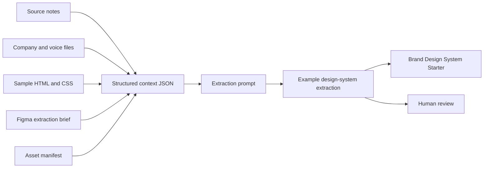

# Brand Context System

A working, public-safe brand context bundle for design-system extraction and front-end handoff.

This repo is no longer just a folder scaffold. It contains a complete demo context system for a fictional brand, including structured JSON, source notes, selected front-end files, asset manifests, Figma extraction guidance, review rules, prompts, an example extraction output, and a validation script.

## What this repo proves

Good AI-assisted design work starts before the prompt. It starts with source-of-truth discipline.

This repo shows how to package scattered brand, design, code, asset, and review context so a designer, engineer, or AI assistant can produce a reviewable design-system extraction without a long verbal download.

## Demo brand

The included demo brand is **Northstar Growth Studio**, a fictional public-safe B2B brand. It is used only to demonstrate the workflow.

The demo includes company context, brand notes, voice rules, structured JSON, extraction targets, sample HTML and CSS, an asset manifest, Figma extraction guidance, design-system requirements, an extraction prompt, an example output, and validation logic.

## How this connects to Brand Design System Starter

`brand-context-system` is the intake layer. It gathers brand rules, voice, code references, Figma direction, assets, examples, and review rules.

[`brand-design-system-starter`](https://github.com/silvermanjared-web/brand-design-system-starter) is the implementation layer. It turns that context into tokens, foundations, component guidance, CSS variables, and front-end handoff.

Together, the two repos show the full tactic: collect the right brand context, then convert it into reusable design-system structure.

## Context flow

## Validation

The repo includes package metadata and a validation script. The validation flow checks that the working context bundle exists, JSON files are parseable, the asset manifest has rows, and required demo files do not contain unresolved placeholder language.

## Working files

| Path | Purpose |
|---|---|
| `context/brand-context.json` | Structured brand, audience, voice, visual, asset, code, Figma, and review context |
| `context/extraction-targets.json` | Defines what the design-system extraction should produce |
| `schemas/brand-context.schema.json` | JSON schema for the structured context bundle |
| `company/company-name-and-blurb.md` | Human-readable company and positioning context |
| `company/brand-notes.md` | Visual system and brand rules |
| `company/voice-and-tone.md` | Writing rules, vocabulary, and examples |
| `clad-notes/design-system-requirements.md` | Canonical design-system extraction requirements |
| `github-code/frontend-file-inventory.json` | Inventory of selected sample front-end files |
| `github-code/code-review-checklist.md` | Review checklist for extracting code-based design evidence |
| `selected-frontend-subfolder/sample-landing-page.html` | Sample page structure for extraction |
| `selected-frontend-subfolder/sample-styles.css` | Sample CSS values for token extraction |
| `figma/figma-extraction-brief.json` | Figma review expectations and extraction scope |
| `fonts-logos-assets/manifest.csv` | Asset index and license/status notes |
| `web-examples/reference-sites.json` | Pattern reference manifest |
| `claude-prompts/build-design-system-from-context.md` | Ready-to-run extraction prompt |
| `examples/example-output.md` | Concrete example design-system extraction output |
| `scripts/check-context-bundle.js` | Local validation script |

## Review workflow

1. Read `clad-notes/design-system-requirements.md` first.
2. Review `context/brand-context.json` and `context/extraction-targets.json`.
3. Inspect company, voice, visual, asset, Figma, and code references.
4. Use `claude-prompts/build-design-system-from-context.md` to produce an extraction draft.
5. Compare the draft against `examples/example-output.md`.
6. Move reviewed outputs into `brand-design-system-starter` only after gaps are resolved.

## What good looks like

A strong extraction should identify source-backed token candidates, component candidates, voice rules, asset availability, accessibility requirements, missing states, source conflicts, and human review steps.

It should not invent logos, fonts, customer names, metrics, or outcomes.

## Related repos

This repo is part of a connected public system. See the [GitHub Ecosystem Map](https://github.com/silvermanjared-web/growth-architecture-os/blob/main/docs/ecosystem-map.md) for how the repos relate.

Shared terminology: [Common Language](https://github.com/silvermanjared-web/growth-architecture-os/blob/main/docs/common-language.md).

- [`growth-architecture-os`](https://github.com/silvermanjared-web/growth-architecture-os)
- [`brand-design-system-starter`](https://github.com/silvermanjared-web/brand-design-system-starter)

## What this demonstrates

This repo shows the intake side of a design-system workflow: how to make brand, design, code, asset, and prompt context structured enough for consistent extraction and review.

It is not just storage. It is a working context layer with source files, validation, and an example output.