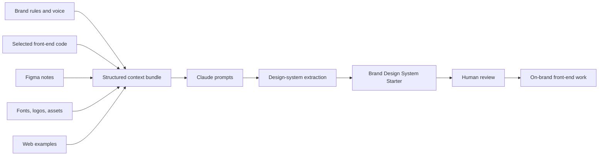

# Brand Context System

A structured context bundle for AI-assisted design and front-end work.

This repo packages the information an AI agent, designer, engineer, or collaborator needs to understand a brand, replicate its design language, and build or review front-end work consistently: brand definition, voice, selected production code, Figma references, asset libraries, real-world examples, and ready-to-run prompts.

Think of it as a **single source of truth** you hand to Claude or a collaborator so they can produce on-brand work without a long verbal download.

## Why this exists

AI-assisted design work is only as good as the context it receives.

When brand rules, assets, code references, Figma links, and working requirements are scattered, the output becomes inconsistent. This repo turns those inputs into a structured handoff system.

The goal is to make design-system extraction, front-end review, and brand-consistent production easier to repeat.

## How this connects to Brand Design System Starter

`brand-context-system` is the intake layer. It gathers brand rules, voice, code references, Figma direction, assets, and examples.

[`brand-design-system-starter`](https://github.com/silvermanjared-web/brand-design-system-starter) is the implementation layer. It turns that context into tokens, foundations, component guidance, CSS variables, and AI-ready front-end handoff.

Together, the two repos show the full tactic: collect the right brand context, then convert it into a reusable design-system structure.

## Context flow



## How to use this repo

1. **Fill in `company/`** — who the company is, brand rules, and voice. This is the foundation everything else references.
2. **Point to code in `github-code/`** — link the production repo and list the specific front-end files worth reviewing. Drop the actual files into `selected-frontend-subfolder/`.
3. **Link Figma in `figma/`** — include the design file plus instructions on what to extract, such as tokens, components, and layouts.
4. **Load assets into `fonts-logos-assets/`** — logos, fonts, icons, and images, all indexed in `manifest.csv`.
5. **Collect references in `web-examples/`** — competitor and best-in-class sites to benchmark against.
6. **Run the prompts in `claude-prompts/`** — reusable instructions that tell Claude how to inspect the code, Figma, and brand context.
7. **Add working notes in `clad-notes/`** — open requirements, decisions, and constraints for the AI or collaborator.
8. **Stage raw inputs in `source-docs/`** — anything not yet processed into the structure above.

## Example output

See [`examples/example-output.md`](examples/example-output.md) for a mock design-system extraction showing brand summary, voice direction, visual direction, front-end notes, risks, and recommended next steps.

## Folder map

```text
README.md                          ← you are here
company/                           ← brand identity, rules, voice
github-code/                       ← links and manifest for production front-end code
selected-frontend-subfolder/       ← focused front-end files copied in for review
figma/                             ← design file links and extraction instructions
fonts-logos-assets/                ← logos, fonts, icons, images, and manifest.csv
web-examples/                      ← reference sites and landing pages
claude-prompts/                    ← reusable prompts for AI inspection and build work
clad-notes/                        ← design-system requirements and working notes
source-docs/                       ← raw, unprocessed inputs
```

## Conventions

- Keep every Markdown file front-loaded: the most important context should appear in the first five lines.
- Use `manifest.csv` files as the index of record for binary assets. Do not rely on folder browsing alone.
- When a file is a placeholder, leave a `> TODO:` line so gaps are obvious at a glance.
- Treat `clad-notes/design-system-requirements.md` as the canonical working spec. If code and that file disagree, the requirements file wins until updated.
- Keep raw material separate from processed guidance.

## What good looks like

A strong version of this repo should make it easy to answer:

- What brand is this for?
- What should the brand sound like?
- What should the interface feel like?
- Which front-end files matter?
- Which assets are official?
- Which Figma file should be referenced?
- Which prompts should be run?
- What requirements or constraints are active?

## What this demonstrates

This repo shows how brand, design, code, assets, and AI prompts can be packaged into a reusable operating system for design-system work.

It is not just storage. It is a structured context layer for more consistent AI-assisted design and front-end execution.