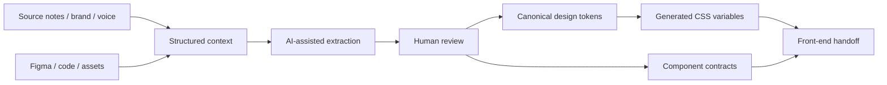

# AI Context & Design System

**A context-to-implementation operating system for AI-assisted brand and front-end work.**

This repository combines the two halves that matter in AI-assisted design: structured source context and reusable implementation rules.

It packages public-safe brand, voice, asset, code, and Figma inputs; turns them into reviewable extraction targets; and carries approved outputs forward into design tokens, CSS variables, and component contracts.

The included Northstar Growth Studio example is fictional and exists only to demonstrate the workflow.

## Five-minute proof

Run:

```bash
npm test
```

That executes smoke, unit, security, context, and manifest validation.

Then inspect:

- `context/brand-context.json` for structured source context.
- `claude-prompts/build-design-system-from-context.md` for the extraction contract.
- `examples/example-output.md` for a source-backed extraction.
- `design-system/tokens.json` for canonical implementation tokens.
- `design-system/tokens.css` for generated CSS variables.
- `design-system/components.md` for reusable component contracts.

## Selected evidence

| Question | Evidence |
|---|---|
| Can AI work from structured context instead of a long prompt? | Source notes, JSON context, manifests, Figma guidance, and code references |
| Can the context produce implementation structure? | Canonical design tokens, generated CSS, and component contracts |
| Can provenance stay visible? | Source documents, asset manifest, extraction targets, and review rules |
| Can missing information remain a gap instead of becoming hallucinated design direction? | Governance and prompt constraints |
| Can the workflow be validated? | Smoke, unit, security, context, and manifest checks |
| Can humans and AI share the same operating context? | ChatGPT and Claude handoff files plus deterministic source structure |

## What I built

The repository now owns the complete public workflow from intake through implementation:


```mermaid
flowchart LR
    S[Source notes / brand / voice] --> C[Structured context]
    F[Figma / code / assets] --> C
    C --> X[AI-assisted extraction]
    X --> R[Human review]
    R --> T[Canonical design tokens]
    T --> CSS[Generated CSS variables]
    R --> CMP[Component contracts]
    CSS --> H[Front-end handoff]
    CMP --> H
```

This replaces the older split where context lived in one repository and design-system implementation lived in another.

## Core point of view

Good AI-assisted design starts before generation.

The quality of the output depends on whether the system can answer:

- What is authoritative?
- What is observed versus inferred?
- Which assets are actually approved?
- Which design values are canonical?
- Which implementation files are generated?
- What still requires human judgment?

The operating principle is **context first, generation second, review before canon**.

## Signature frameworks

### Context → Extract → Review → Implement

1. **Context**: package source-backed brand, voice, asset, Figma, and code inputs.
2. **Extract**: generate candidates with source references and confidence.
3. **Review**: resolve gaps and conflicts explicitly.
4. **Implement**: promote approved values into tokens and component contracts.

### Canonical source / generated derivative

- `design-system/tokens.json` is canonical.
- `design-system/tokens.css` is generated.
- Component contracts are human-readable implementation rules.
- Prompts and extraction output do not become canon automatically.

### Evidence before invention

If a logo, font, customer name, metric, breakpoint, component state, or interaction is not supported by the source context, the system records the gap instead of filling it with plausible detail.

## Ecosystem map

This repository is the context and design implementation layer in the broader [Growth Architecture OS](https://github.com/silvermanjared-web/growth-architecture-os) portfolio.

- **Growth Architecture OS**: growth leadership and operating philosophy.
- **Marketing Intelligence Agent**: source-aware intelligence and agent routing.
- **Marketing Ops Toolkit**: deterministic checks and bounded execution.
- **AI Context & Design System**: context engineering and implementation handoff.
- **Private-to-Public Release Gate**: privacy-safe publication boundary.

The shared [AI Operating System Reference](https://github.com/silvermanjared-web/growth-architecture-os/tree/main/04-ai-systems/ai-operating-system-reference) explains the architecture pattern used across the public technical repos.

## How to read this repo

For a quick proof, run `npm test` and inspect the context JSON plus design tokens.

For context engineering, start with `source-docs/`, `context/`, `figma/`, and `github-code/`.

For AI handoff, read `CLAUDE.md`, `CHATGPT.md`, and `claude-prompts/`.

For implementation, read `design-system/` and `scripts/build-design-tokens.js`.

For safety and authority, read `GOVERNANCE.md`, `SECURITY.md`, and `USAGE.md`.

For portfolio evidence, read `proof-points.md`.

## Working map

| Area | Purpose |
|---|---|
| `source-docs/` | Raw public-safe source evidence |
| `context/` | Structured brand and extraction context |
| `company/` | Human-readable brand and voice rules |
| `figma/` | Figma review and extraction guidance |
| `github-code/` | Code evidence and manifests |
| `fonts-logos-assets/` | Asset manifest and demo assets |
| `claude-prompts/` | Reusable AI extraction prompts |
| `examples/` | Example reviewed extraction |
| `design-system/` | Canonical tokens, generated CSS, and component contracts |
| `scripts/` | Generation and validation |
| `tests/` | Unit checks |
| `_meta/` | Content map and repository metadata |

## Further reading

- [AI Operating System Reference](docs/ai-operating-system-reference.md)
- [Design System Requirements](claude-notes/design-system-requirements.md)
- [Example Extraction](examples/example-output.md)
- [Proof Points](proof-points.md)
- [Security Policy](SECURITY.md)

## Related repos

- [Growth Architecture OS](https://github.com/silvermanjared-web/growth-architecture-os)
- [Marketing Intelligence Agent](https://github.com/silvermanjared-web/marketing-intelligence-agent)
- [Marketing Ops Toolkit](https://github.com/silvermanjared-web/marketing-ops-toolkit)
- [Private-to-Public Release Gate](https://github.com/silvermanjared-web/private-to-public-release-gate)

The older `brand-design-system-starter` repository is retained as a historical reference. This repository is now the public source of truth for the combined context-to-design workflow.

## IP and usage

This repository is public for professional review and portfolio context. It is not licensed for commercial reuse, resale, model training, or derivative productization without permission.

See [USAGE.md](USAGE.md).